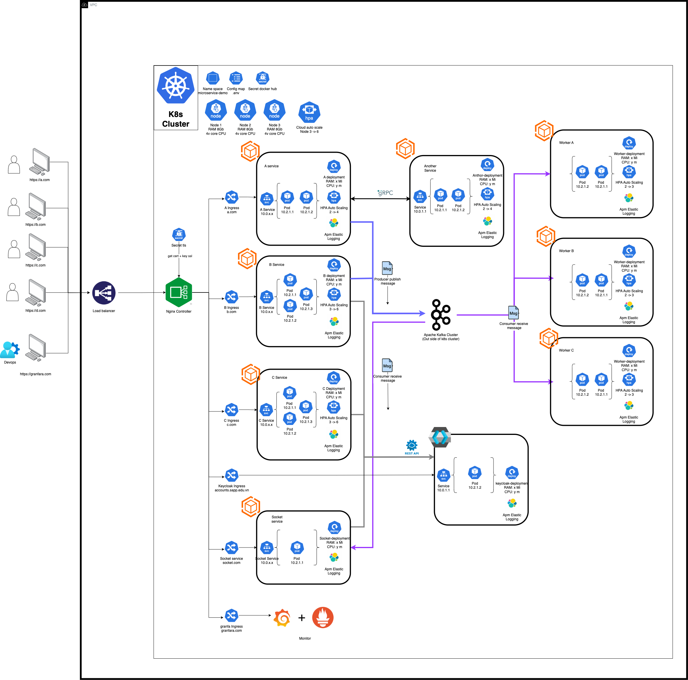

# Microservices Infrastructure Deployment on Kubernetes

This repository showcases the infrastructure deployment of a microservices architecture on a Kubernetes cluster. The implementation leverages modern DevOps practices and scalable design principles.

## **Overview**

The system follows an **event-driven microservices architecture** designed for scalability, reliability, and maintainability. It incorporates:

- **Monorepo structure** for efficient management.
- **Domain-Driven Design (DDD)** and **CQRS pattern** for business logic separation.
- **Blue/Green deployment strategy** for seamless continuous delivery.
- **Auto-scaling** at:
  - Node level for system optimization.
  - Application level for handling varying workloads.
- **Distributed logging** with APM integration for production-grade observability.

## **Infrastructure Diagram**

The deployment includes the following components:
- **Kubernetes Cluster** for container orchestration.
- **CI/CD Pipeline** using GitLab for automating build, test, and deployment.
- **ELK Stack** (Elasticsearch, Logstash, Kibana) for centralized logging.
- **Prometheus and Grafana** for monitoring and alerting.

  
*(Replace with the link to your uploaded diagram in this repo.)*

## **Key Features**

1. **Microservices Architecture**
   - Event-driven design for asynchronous communication.
   - Monorepo for streamlined development and deployment.
   - Domain-Driven Design principles applied to structure bounded contexts.

2. **CI/CD Pipeline**
   - Built with **GitLab CI/CD**.
   - Supports **Blue/Green deployment** for minimal downtime.

3. **Observability**
   - Distributed logging using **ELK stack**.
   - Application Performance Monitoring (APM) integrated into services.
   - Efficient log tracing in production environments.

4. **Scalability**
   - Auto-scaling configurations for both:
     - **Node level** to dynamically adjust cluster resources.
     - **Application level** to handle workload peaks.

## **Getting Started**

### Prerequisites

- **Kubernetes** cluster with at least 3 worker nodes.
- **Helm** installed for managing deployments.
- Access to a **GitLab** CI/CD runner.

### Setup

1. Clone this repository:
   bash
   `git clone https://github.com/Tuannguyen7598/microservice-k8s-demo.git`
   `cd your-repo-name`
2. Apply Kubernetes manifests:
   `kubectl apply -f k8s-manifests/`
3. Deploy CI/CD pipeline: Update the .gitlab-ci.yml file with your cluster credentials and trigger the pipeline.
4. Configure monitoring and logging:
   Deploy Prometheus and Grafana using Helm charts.
   Set up the ELK stack using the provided configurations in elk/.
### Diagram Editing
If you want to modify the infrastructure diagram:

The source file is located in diagrams/. Use draw.io or your preferred diagram tool for edits.

### Folder Structure
├── k8s-manifests/         # Kubernetes deployment and service manifests
├── ci-cd/                 # GitLab CI/CD pipeline configuration
├── diagrams/              # Architecture diagrams (source and export)
├── elk/                   # Configurations for ELK stack setup
├── monitoring/            # Prometheus and Grafana setup
└── README.md              # Documentation

### Contributing

Contributions are welcome! Please submit a pull request or raise an issue to suggest improvements or fixes.

### License
This project is licensed under the MIT License. See LICENSE for details.

### Contact
For any questions, feel free to reach out:

Author: Nguyễn Quang Tuấn
Email: quangtuan070598@gmail.com
