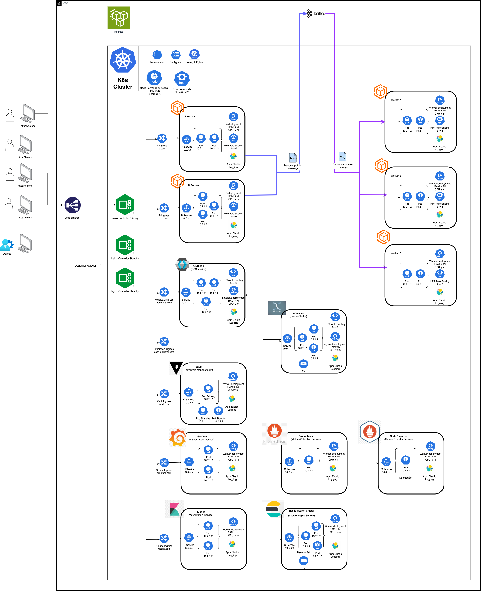

# Microservice Architecture for Scalable Backend for Frontend (BFF)
 
## Overview

This project demonstrates a **Microservice Architecture** designed for a **Backend for Frontend (BFF)** deployment in a secure, multi-tiered cloud environment. The system is designed to be **highly available**, **scalable**, and **resilient** while also ensuring **security**, **observability**, and **efficiency**. The architecture integrates several key components including **SSO with Keycloak**, **Kafka** as the message broker, **Nginx Ingress Controller** for routing traffic, **Vault** for sensitive data management, and **ElasticSearch** with **Kibana** for logging and monitoring.

## Architecture Components

### 1. **Cloud Infrastructure**
The project is deployed on a **cloud platform**, within a single **VPC (Virtual Private Cloud)** to ensure security. The infrastructure is designed with multiple layers for secure traffic flow:
- **VPC**: All components are deployed within a single VPC to ensure private and secure communication.
- **Load Balancer**: The outermost layer is the **Load Balancer**, which routes incoming traffic from the internet to the appropriate services within the Kubernetes cluster.

### 2. **Kubernetes Cluster (K8s Cluster)**
The application is deployed using **Kubernetes** to manage containerized services:
- **Worker Nodes (A, B, C)**: Multiple nodes running application services and other components.
- **Pods**: Each microservice runs inside **Pods**. The services are designed for autoscaling based on traffic and load.
- **Namespaces**: Kubernetes namespaces are used to logically separate and manage the services.
- **Deployments**: Kubernetes **Deployments** are used to manage the rolling updates of each service while ensuring high availability and scaling.
- **Persistent Volumes (PV)**: Persistent storage for applications that require stateful data.
- **Network Policies**: Control and secure the communication between pods, ensuring that only authorized services can communicate with each other.
- **Autoscaling**: The system is set up for **Horizontal Pod Autoscaling (HPA)**, ensuring that pods scale dynamically based on load and traffic.

### 3. **Backend for Frontend (BFF)**
The system is designed using a **Backend for Frontend (BFF)** pattern, where backend services are specifically tailored for the needs of frontend applications (e.g., web or mobile apps).

### 4. **SSO with Keycloak**
**Keycloak** is used for **Single Sign-On (SSO)**:
- **Identity and Access Management**: Keycloak handles user authentication, authorization, and federated identity management.
- **OAuth2 / OpenID Connect (OIDC)**: Keycloak provides token-based authentication, ensuring secure and centralized login for all services.
- **User Federation**: Keycloak can be integrated with existing LDAP or Active Directory systems for user management.

### 5. **Kafka (Message Broker)**
**Kafka** is utilized as the message broker for inter-service communication:
- **Cloud-based Kafka**: A managed Kafka service is used to handle the messaging and ensure reliable, scalable event-driven architecture.
- **Producer and Consumer**: Services produce events that are consumed by other services for processing.

### 6. **Nginx Ingress Controller**
The **Nginx Ingress Controller** is used to manage HTTP traffic to the services:
- **Traffic Routing**: Routes incoming requests to the appropriate services within the Kubernetes cluster.
- **Load Balancing**: Ensures the distribution of traffic across multiple replicas of each service for high availability.

### 7. **Cache with Infinispan**
The system uses **Infinispan** for **caching** to improve performance and support autoscaling:
- **Infinispan Cluster**: Infinispan is deployed as a clustered cache to store frequently accessed data and session information.
- **Cache for Keycloak**: Keycloak’s sessions and data are stored in the Infinispan cache to improve performance and scalability.

### 8. **Vault (Sensitive Data Management)**
**Vault** is used to securely store and manage sensitive data, such as API keys, database credentials, and certificates:
- **Secrets Management**: Vault dynamically generates and stores secrets, ensuring that only authorized services have access to them.
- **Encryption**: Vault handles encryption and decryption of sensitive data both at rest and in transit.

### 9. **Monitoring & Metrics Collection**
The system includes robust monitoring and observability:
- **Prometheus**: Collects metrics from Kubernetes nodes and services via **Node Exporters** and **Kubernetes Metrics Server**.
- **Grafana**: Provides real-time dashboards for visualizing the metrics collected by Prometheus.
- **Prometheus Metrics**: Metrics such as CPU usage, memory consumption, and service health are collected and monitored.

### 10. **Logging with ELK Stack**
**ElasticSearch**, **Logstash**, and **Kibana** (ELK Stack) are used for logging:
- **ElasticSearch**: Stores logs from all services in a centralized location for easy search and analysis.
- **Kibana**: Provides a web interface for querying and visualizing logs stored in ElasticSearch.
- **Logstash**: Collects, processes, and forwards logs to ElasticSearch for indexing.

### 11. **APM (Application Performance Monitoring)**
The entire system is monitored using **APM** tools:
- **Application Performance Monitoring**: All services are instrumented to capture key metrics like latency, error rates, and request volumes.
- **Real-time Insights**: APM tools provide real-time insights into application performance and service health.

### 12. **Security**
Security is a key consideration throughout the architecture:
- **Vault**: Ensures sensitive data is encrypted and only accessible by authorized services.
- **Network Policies**: Kubernetes network policies control pod-to-pod communication and prevent unauthorized access.
- **Keycloak**: Provides centralized identity and access management, ensuring secure user authentication.

## Deployment Strategy

### High Availability and Scalability
The architecture is designed for both **High Availability (HA)** and **Scalability**:
- **Horizontal Pod Autoscaling**: Automatically scales the number of pod replicas based on resource usage.
- **Rolling Updates**: Kubernetes deployments allow for **zero-downtime** updates by updating pods one at a time.

### Deployment Workflow:
1. **Kubernetes Cluster Setup**: Set up a Kubernetes cluster on the cloud with at least three worker nodes to ensure high availability.
2. **Nginx Ingress Controller**: Install and configure the Nginx ingress controller to manage HTTP traffic routing.
3. **Keycloak Setup**: Configure Keycloak for identity and access management (SSO).
4. **Kafka Setup**: Configure cloud-based Kafka for message brokering between services.
5. **Service Deployment**: Deploy microservices using Kubernetes deployments, ensuring proper scaling, autoscaling policies, and persistent volumes where required.
6. **Infinispan Cache Setup**: Deploy Infinispan as a distributed cache for session management and improve performance.
7. **Vault Setup**: Configure Vault for storing and managing sensitive information securely.
8. **Prometheus and Grafana Setup**: Set up Prometheus to collect metrics and Grafana to visualize them.
9. **ELK Stack**: Deploy ElasticSearch, Logstash, and Kibana for centralized logging and log analysis.
10. **APM Integration**: Integrate APM tools to monitor the performance of each service.

## Technologies Used

- **Kubernetes** for container orchestration and management.
- **Nginx** for traffic management and load balancing.
- **Kafka** for event-driven communication and messaging.
- **Keycloak** for Single Sign-On (SSO) and identity management.
- **Vault** for managing and securing sensitive data.
- **Prometheus** for collecting system metrics and monitoring.
- **Grafana** for real-time data visualization.
- **ElasticSearch**, **Logstash**, **Kibana** (ELK) for logging and log analysis.
- **Infinispan** for caching and session management.

## Conclusion

This architecture provides a highly available, scalable, and secure solution for deploying microservices in a cloud environment using Kubernetes. It ensures efficient traffic management, robust monitoring, centralized logging, and secure handling of sensitive data, making it ideal for modern cloud-native applications.

## License

This project is licensed under the MIT License - see the [LICENSE](LICENSE) file for details.
